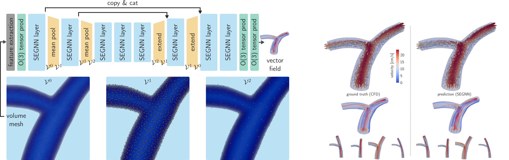

_If you like this work, also check out our latest iteration [LaB-GATr](https://github.com/sukjulian/lab-gatr) which can be used for the same applications and more!_

# SEGNN for hemodynamics


This repository contains the code for the paper "SE(3) symmetry lets graph neural networks learn arterial velocity estimation from small datasets" [[arXiv]](https://arxiv.org/abs/2302.08780) [[Springer]](https://link.springer.com/chapter/10.1007/978-3-031-35302-4_46) (FIMH 2023).

## Getting started
Set up the Conda environment (CUDA 11.7) by running
```
conda env create -f environment.yml -n segnn-hemo
conda activate segnn-hemo
```
and download (a tiny subset of) our dataset from [here](https://surfdrive.surf.nl/files/index.php/s/jS078iW3HIwTlLz) and pre-trained SEGNN weights from [here](https://drive.google.com/file/d/1VY1lkK-SsXmv9w4TuNFewxtK5YAFgSdk/view?usp=share_link). Place `lumen_tiny.hdf5` into the directory `./lumen-dataset/raw/` and leave `neural_network_weights.pt` at `./`. If everything is set up correctly, after running
```
python main.py --num_epochs 0
```
the first thing you will see is pre-processing of the dataset. I recommend [ParaView](https://www.paraview.org/) to view the visuals.

## Using your own data
You can train SEGNN on your own volume meshes. The easiest way to do so is to process your meshes to match our framework. Save your data in an HDF5 file, e.g. using [`h5py`](https://docs.h5py.org/en/stable/), matching our structure:
```
database.hdf5
├── sample-0000
│   ├── velocity           # N x 3
│   ├── pos_tets           # N x 3
│   ├── tets               # M x 4
│   ├── inlet_idcs         # indexing pos_tets (values in [0, N))
│   ├── lumen_wall_idcs    # indexing pos_tets (values in [0, N))
│   └── outlets_idcs       # indexing pos_tets (values in [0, N))
│
├── ...
│
└── sample-1999
    ├── velocity
    ├── pos_tets
    ├── tets
    ├── inlet_idcs
    ├── lumen_wall_idcs
    └── outlets_idcs5
```
If you have questions, feel free to open an [issue](https://github.com/sukjulian/segnn-hemodynamics/issues) or [contact me](mailto:j.m.suk@utwente.nl). Depending on the size of your meshes, parallelised training across multiple GPUs might be neccessary. Distributed parallel training is available via the option `--num_gpus`. If you are not sure how to set the radii in `PoolingClusterSampling` you can try using `scripts/estimate_neighbourhoods_radii.py`.

## Credits
If you found this repository useful, please consider citing our paper:
```
@inproceedings{Suk2023SE3Symmetry,
  author = "Suk, Julian and Brune, Christoph and Wolterink, Jelmer M.",
  title = "{SE(3)} Symmetry Lets Graph Neural Networks Learn Arterial Velocity Estimation from Small Datasets",
  booktitle = "Functional Imaging and Modeling of the Heart",
  year = "2023",
  publisher = "Springer Nature Switzerland",
  address = "Cham",
  pages = "445--454",
  isbn = "978-3-031-35302-4"
}
```
